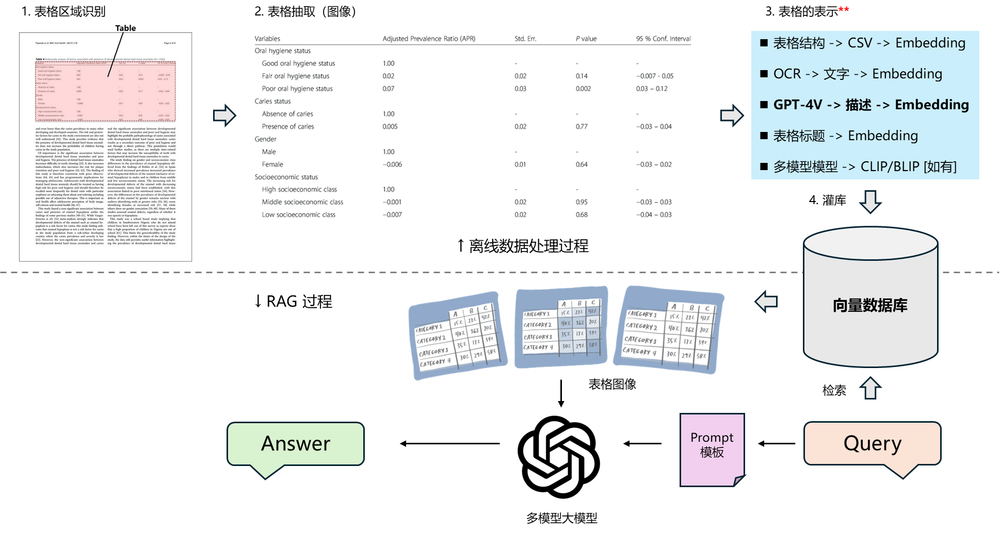

# LLMs-Lab  

Full-stack LLM Engineering Lab. Features: Autonomous Agents (ReAct/AutoGPT) | Fine-Tuning Llama/Mistral (SFT/DPO) | Large Model Deployment (DeepSeek 671B / 2.5-bit) | Advanced RAG (Hybrid Search) | Function Calling (Stream/Text-to-SQL/External APIs) | Frameworks (LangChain, Semantic Kernel, OpenAI) | Daily SOTA Paper Tracking. From theory to 0-to-1.
  
## 9. 📂 [DeepSeek](DeepSeek/)
Focused on **Inference Optimization** and **Low-Bit Quantization** strategies for massive-scale MoE models (600B+ parameters).

- **DeepSeek-R1 (671B) 2.51-bit Extreme Quantization Deployment**:
  - Deployed the **2.51-bit quantized version** (via Unsloth) of the 671B MoE model, achieving an **~80% reduction** in memory footprint (from 720GB to ~212GB).
  - Analyzed official and community benchmarks for **1.58-bit vs 2.51-bit** configurations, ultimately selecting the 2.51-bit build (Q2_K_XL) to ensure superior reasoning stability on the H20 GPU cluster.
  - 📄 **[View Hands-on Deployment Log & Benchmarks (PDF)](DeepSeek/Hands-on%20deployment%20of%20671B%20model%20inference%20(2.51-bit%20quantization).pdf)**
  
## 8. 📂 [Fine-Tuning](Fine-Tuning/)

This directory bridges the gap between theoretical architecture analysis and practical, memory-efficient fine-tuning of state-of-the-art open-source models. It covers the full lifecycle from pre-training understanding to post-training alignment.

### Key Modules

- **[Transformer Source Code Analysis](Fine-Tuning/AnnotatedTransformer.ipynb)**: A deep dive into the vanilla Transformer architecture, focusing on a line-by-line implementation analysis of **Self-Attention mechanisms**, Multi-Head Attention, and Layer Normalization to understand the foundational building blocks.

- **[Llama Series: QLoRA & Quantization](Fine-Tuning/Llama%20%20Fine-Tuning%20&%20Quantization%20&%20Running%20&%20Instroducntion%20&%20Deployment.pdf)**: Implementation of **[QLoRA](Fine-Tuning/Lora%20code.ipynb)** (Quantized Low-Rank Adapters) to fine-tune Llama 2 (7B/13B) on consumer hardware.
  - Analyzed **4-bit NormalFloat (NF4)** quantization and Double Quantization for memory optimization.
  - Covered the full pipeline: Data Prep → Fine-tuning → Merging Adapters → Quantization → Deployment.

- **[Mistral 7B: Architecture & Domain Adaptation](Fine-Tuning/Mistral%207B%20Fine-Tuning.pdf)**: Fine-tuned Mistral 7B for a **Generative Recommendation** task.
  - Explored Mistral's specific architectural advantages, including **Sliding Window Attention (SWA)** for long contexts and **Grouped-Query Attention (GQA)** for inference speedup.

- **[TRL (Transformer Reinforcement Learning)](Fine-Tuning/TRL_Train%20transformer%20language%20models%20with%20reinforcement%20learning_huggingface.pdf)**: Leveraged Hugging Face's `TRL` library to implement the alignment pipeline:
  - **[SFT (Supervised Fine-Tuning)](Fine-Tuning/Instruct_data_pipline.ipynb)**: Instruction tuning with formatted datasets.
  - **DPO (Direct Preference Optimization)**: Implemented DPO as a more stable and efficient alternative to PPO for aligning models with human preferences.
  
## 7. 📂 [Agent](Agent/) 

This directory bridges the gap between Agentic theory and engineering practice, featuring both an interactive guide and a production-ready framework implemented from scratch (0 to 1).

### 📘 [Guide & Theory (index.ipynb)](Agent/index.ipynb)
A comprehensive interactive notebook that documents the design philosophy:
- **Agent Design Paradigms**: Explores core concepts like Reflection, Tool Use, and Planning (referenced from Andrew Ng's framework).
- **System Architecture**: Visualizes the **Core Module Flowchart** and data flow between Memory, Tools, and the Planning engine.
- **Use Case Demonstrations**: Step-by-step walkthroughs of real-world scenarios (e.g., Sales Analysis, Automated Reporting).

### 🛠️ [Implementation (Agent_Project)](Agent/Agent_Project/)
A modular, task-oriented AI Agent Framework engineered for autonomous execution:

- **Decoupled Architecture**: Separates **Core Logic (AutoGPT)**, **Execution (Tools)**, and **State Management (Memory)** for high extensibility.
- **ReAct Reasoning Engine**: Implements a custom `Thought → Plan → Action → Observation` loop to handle **multi-step goal decomposition** and self-correction.
- **Tool Orchestration**: Integrated functional tools for non-deterministic tasks:
  - **Code Interpreter (`PythonTool`)**: Dynamic script-based auditing using custom heuristics and strict library constraints.
  - **Data Analysis (`ExcelTool`)**: Deep analysis of structured files via Pandas.
  - **Communication (`EmailTool`)**: Automated drafting and sending of notifications.
  - **Content Generation (`WriterTool`)**: AI-driven formal document generation based on requirements.
  - **RAG QA (`FileQATool`)**: PDF/Docx retrieval and interrogation.

- **📂 Project Structure**:
  ```text
  Agent
  ├── Agent_Project
  │   ├── Agent               # Core Reasoning Logic (The Brain)
  │   │   ├── Action.py       # Defines Action Pydantic models
  │   │   ├── AutoGPT.py      # Implements the ReAct (Thought-Plan-Action) Loop
  │   │   └── ...
  │   ├── Tools               # Functional Capabilities (The Hands)
  │   │   ├── EmailTool.py    # Automated Email Sender
  │   │   ├── ExcelTool.py    # Data Inspection via Pandas
  │   │   ├── FileQATool.py   # PDF/Doc Retrieval QA (RAG)
  │   │   ├── FileTool.py     # File System Navigation
  │   │   ├── PythonTool.py   # Code Interpreter & Sandbox
  │   │   ├── WriterTool.py   # AI Document Generator
  │   │   └── Tools.py        # Tool Registry & Definitions
  │   ├── Utils               # Helper functions (Logging, Callbacks)
  │   ├── data                # Demo Data (Sales Records, Supplier PDFs)
  │   ├── prompts             # Prompt Engineering Templates
  │   │   ├── main
  │   │   │   ├── main.txt        # System Prompt: Constraints & Logic
  │   │   │   └── final_step.txt  # Summarization Prompt
  │   │   └── tools
  │   │       └── excel_analyser.txt # Code Gen Constraints for PythonTool
  │   ├── .env                # Environment variables (API Keys)
  │   ├── examples.txt        # Few-shot prompting examples
  │   ├── main.py             # Entry point / Execution script
  │   └── requirements.txt    # Python dependencies
  └── index.ipynb             # Interactive Theory & Architecture Guide
  
## 6. 📂 [LangChain](LangChain/)  

#### The contents of the 'LangChain.ipynb' file located in the LangChain folder are detailed below:  

### Core Components of LangChain

- #### Model I/O Wrapping

**LLMs**: Large Language Models  
**Chat Models**: Generally based on LLMs but restructured for conversational purposes  
**PromptTemplate**: Templates for prompt creation  
**OutputParser**: Parses the output from models  

  - #### Data Connection Wrapping  

**Document Loaders**: Loaders for various file formats  
**Document Transformers**: Common operations on documents such as splitting, filtering, translating, and extracting metadata  
**Text Embedding Models**: Convert text into vector representations, useful for tasks like retrieval  
**Vectorstores**: Stores for vectors (used in retrieval tasks)  
**Retrievers**: Tools for retrieving vectors from storage  
**RAG Pipline with Langchain**

- #### Memory Wrapping

**Memory**: Not physical memory; it manages "context", "history", or "memory" from a text perspective


- #### Architecture Wrapping

**Chain**: Implements a single function or a series of sequential functions, LangChain Expression Language (LCEL)   
**Agent**: Automatically plans and executes steps based on user input, selecting the necessary tools for each step to achieve the desired task  
**Tools**: Functions for calling external functionalities, such as Google search, file I/O, Linux shell, etc.    
**Toolkits**: A set of tools designed to operate specific software, such as a toolkit for managing databases or Gmail    

- #### Callbacks  

## 5. 📂 [Semantic-Kernel](Semantic-Kernel/)  

The code examples in this folder, including **Prompt Templates**, **Nested Function Calls**, **RAG**, and **Using the Planner to Implement Agent Development**, demonstrate the features and basic usage of Semantic Kernel. They also provide an understanding of its built-in tools, illustrating how the SDK can be used to simplify the development of LLM-based applications.

## 4. 📂 [RAG](RAG/) 

This folder contains three different **RAG (Retrieval-Augmented Generation)** pipelines. The first one is based on Elasticsearch (ES), the second one is based on a vector database, ChromaDB, and the last RAG Pipline shows how to use data from tables in PDFs to implement RAG.  
  

### Pipelines

- **`run_RAG_vector_database_pipeline`**:
    
  RAG Pipeline based on ChromaDB Vector Database.

      The Offline Steps are as follows:  

      | Document Loading      | Document Splitting  | Vectorization | Insert into Vector Database  |
      |-----------------------|---------------------|---------------|------------------------------|
      |          →            |        →            |      →        |               →              |
      
      The Online Steps are as follows:  
      
      | Receive User Query    | Vectorize User Query | Retrieve from Vector Database | Populate Prompt Template  | Call LLM with Final Prompt | Generate Response   |
      |-----------------------|----------------------|-------------------------------|---------------------------|----------------------------|---------------------|
      |           →           |           →          |                →              |                 →         |                →           |          →          |  


- **`run_RAG_ES_pipeline`**:
    
  RAG Pipeline based on Elasticsearch (ES).

- **`RAG_pipeline_pdf_table_processing`**:  
    
  In this RAG Pipline, use data from tables in PDFs to implement RAG.    
  
  Offline:  
    
  Convert PDF to images and extract tables from the images → Use GPT-4 to generate textual descriptions of the table images → Store the textual descriptions (documents), their embeddings (embeddings), and image URLs (metadatas) into the vector database.
    
  Online:
    
  Receive a query and search the vector database → Retrieve table image URLs from search results (based on similarity between textual descriptions and the query) → Use GPT-4 to query and retrieve information from the table images.
    
      
  The pipeline flowchart is as follows:
    
  
    
## 3. 📂 [Function-Calling](Function-Calling/)  

This folder contains various demos showcasing the capabilities of Function Calling.  

### Function Calling Demos

   - **`POI(Point of Interest)`**:
       
     This demo uses Amap's (Gaode Map) public API to retrieve information about hotels, restaurants, attractions, and other points of interest (POIs) near a specific location. It allows querying nearby POIs relative to a given point.

   - **`SQL`**:
       
     This demo demonstrates how Function Calling handles sophisticated database tasks and generates SQL queries.

   - **`Stream`**:
       
     This demo showcases examples of Function Calling in Stream mode.


## 2. 📂 [Task-oriented Dialogue System](Task-oriented Dialogue System/)    

   This demo implements a multi-turn, task-oriented intelligent customer service system using gpt-3.5-turbo API.    

##  1. 📂 [OpenAI](OpenAI/)    
  
 - **`Text To Speech`**:
     text_to_speech 
  
## 0. 📂 [Docs](Docs/)    

	Research papers and technical docs on LLMs.
  
##  📂 [Z_Others](Z_Others/) 